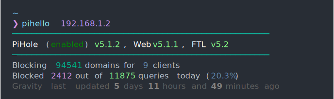

<div align="center">
  <h1>pihello</h1>
  <p>
    <b>pihello</b> is a <u>simple</u> and <u>configurable</u>
    command-line tool used to display statistics of your Pi-hole.
    <br>
    <i>No additional dependencies required.</i>
  </p>
  <a href="https://pypi.org/project/pihello/">
    
  </a>
  
  
  
  <a href="https://github.com/pavelgar/pihello#development">
    
  </a>
  <p></p>
  
</div>

## What's this used for?

You frequently work in the terminal or ssh into your pi-hole host? Wouldn't it be nice to have a useful greeting message?

Just install and add the `pihello <your.pihole.address> <your.pihole.api-token>` command to your shell's startup script (`.bash_profile`, `.zshenv`, `fish_greeting.fish`, etc.). Next time you open the terminal you'll be greeted by the default _(or your own)_ fancy message!

## Installation

### Requirements

- A running [pi-hole](https://pi-hole.net/) instance
- [Python >=3.8](https://www.python.org/downloads/)

### Quickstart

Install:

```
pip install pihello
```

Run a preconfigured display (as seen above):

```
pihello <your.pihole.address> <your.pihole.api-token>
```

## Usage

### Examples

To run from the command line for standard HTTP Pi-hole installs:

```
pihello <your.pihole.address> <your.pihole.api-token>
```

To run from the command line with a custom configuration file:

```
pihello <your.pihole.address> <your.pihole.api-token> -f /path/to/config.txt
```

To run from the command line for HTTPS Pi-hole installs:

```
pihello <your.pihole.address> <your.pihole.api-token> -p
```

To run from the command line for HTTPS Pi-hole installs w/custom path to pihole (e.g. `/pihole` instead of the default `/admin`) :

```
pihello <your.pihole.address> <your.pihole.api-token> -p -u /pihole
```

Full command options:

```
$ pihello -h
usage: pihello [-h] [-v] [-i INDENT] [-f FILE] [-c] [-W WIDTH] [-H HEIGHT] [-ts [TIMESTAMP]] [-p] [-u URI] addr token

positional arguments:
  addr                  the address of your Pi-hole
  token                 your Pi-hole API Token from settings

optional arguments:
  -h, --help            show this help message and exit
  -v, --version         show program's version number and exit
  -i INDENT, --indent INDENT
                        set the indentation step (default: 4)
  -f FILE, --file FILE  specify path to the output config file
  -c, --clip            set whether overflowing text will be discarded or added to the next line
  -W WIDTH, --width WIDTH
                        set the screen width (0 = no limit). (default: 80)
  -H HEIGHT, --height HEIGHT
                        set the screen height (0 = no limit). (default: 25)
  -ts [TIMESTAMP], --timestamp [TIMESTAMP]
                        add a timestamp as the first line. Pass optional strftime format string. Example "%H:%M - %a %d/%m/%y"
  -p, --proto           use HTTPS instead of HTTP.
  -u URI, --uri URI     set a different path (URI) for pihole. (default: /admin)
```

### Configuration

Create a configuration text file anywhere in your userspace.

**[example.txt](docs/example.txt)**

> More example configurations can be found in [docs/SHOWCASE.md](docs/SHOWCASE.md).

```
[cyan2]─────────────────────────────────────────────────────[]
[white]PiHole[] ([green4]{status}[]) [lightgreen]{core_current}[white], Web [lightgreen]{web_current}[white], FTL [lightgreen]{FTL_current}
[cyan2]─────────────────────────────────────────────────────[]
Blocking [darkcyan]{domains_being_blocked}[] domains for [steelblue]{unique_clients}[] clients
Blocked [fuchsia]{ads_blocked_today}[] out of [lightgreen]{dns_queries_today}[] queries [underline]today[] ([steelblue]{ads_percentage_today}%[])
[grey37]Gravity last updated [bold grey50]{gravity_last_updated.relative.days}[grey37] days [bold grey50]{gravity_last_updated.relative.hours}[grey37] hours and [bold grey50]{gravity_last_updated.relative.minutes}[grey37] minutes ago
```

Run `pihello` with the `-f` flag pointing to the configuration file:

```
pihello <your.pihole.address> <your.pihole.api-token> -f /home/username/path_to/example.txt
```

### Variable injection

PiHole API's variables can be easily injected by using curly braces `{ }`.

**Syntax**: `{variable_name}`

**Example:** `"PiHole {core_current} (FTL: {FTL_current})"`

**Notes:**

- Variable names are case-sensitive
- Open curly brace, which is not part of a variable injection, should be escaped like so `\{`

<details>
<summary><b>Available variables</b></summary>

| Key                                     |              Example value | Type  |
| :-------------------------------------- | -------------------------: | :---: |
| `recent_blocked`                        | `ssl.google-analytics.com` |  str  |
| `core_update`                           |                    `False` | bool  |
| `web_update`                            |                    `False` | bool  |
| `FTL_update`                            |                    `False` | bool  |
| `core_current`                          |                   `v5.1.2` |  str  |
| `web_current`                           |                   `v5.1.1` |  str  |
| `FTL_current`                           |                     `v5.2` |  str  |
| `core_latest`                           |                   `v5.1.2` |  str  |
| `web_latest`                            |                   `v5.1.1` |  str  |
| `FTL_latest`                            |                     `v5.2` |  str  |
| `core_branch`                           |                   `master` |  str  |
| `web_branch`                            |                   `master` |  str  |
| `FTL_branch`                            |                   `master` |  str  |
| `domains_being_blocked`                 |                    `94541` |  int  |
| `dns_queries_today`                     |                    `14324` |  int  |
| `ads_blocked_today`                     |                     `3917` |  int  |
| `ads_percentage_today`                  |                `27.345713` | float |
| `unique_domains`                        |                     `5967` |  int  |
| `queries_forwarded`                     |                     `7942` |  int  |
| `queries_cached`                        |                     `2465` |  int  |
| `clients_ever_seen`                     |                       `12` |  int  |
| `unique_clients`                        |                        `9` |  int  |
| `dns_queries_all_types`                 |                    `14324` |  int  |
| `reply_NODATA`                          |                      `423` |  int  |
| `reply_NXDOMAIN`                        |                      `223` |  int  |
| `reply_CNAME`                           |                     `3784` |  int  |
| `reply_IP`                              |                     `8768` |  int  |
| `privacy_level`                         |                        `0` |  int  |
| `status`                                |                  `enabled` |  str  |
| `gravity_last_updated.file_exists`      |                     `True` | bool  |
| `gravity_last_updated.absolute`         |               `1602374786` |  int  |
| `gravity_last_updated.relative.days`    |                        `1` |  int  |
| `gravity_last_updated.relative.hours`   |                       `12` |  int  |
| `gravity_last_updated.relative.minutes` |                       `29` |  int  |

</details>

### Styling

- Text styling is done by inserting style tags `[ ]`
- Color prepended by a semicolon `:` indicates a **background color**
- Color prepended by an underline `_` indicates an **underlined color**
  _AFAIK, only supported in Kitty, VTE, mintty and iTerm2._

**Syntax:** `[<style> <foreground_color> :<background_color> _<underline_color>]`

**Example:** `"[italic navy]Hello [underline maroon :green]World[bold]!"`

**Notes:**

- Open square bracket, which is not part of a style, must be escaped like so `\[`
- Empty square brackets, `[]`, can be used to reset the style
- Order of the parameters does not matter
- Extra whitespace and letter's case is ignored

<details>
<summary><b>Available styles</b></summary>

| Style            | Format string | Notes                            |
| :--------------- | :-----------: | :------------------------------- |
| Normal           |   `normal`    | Reset the font to normal.        |
| Bold             |    `bold`     |                                  |
| Faint            |    `faint`    |                                  |
| Italic           |   `italic`    |                                  |
| Underline        |  `underline`  |                                  |
| Double underline | `dunderline`  | Usually just a single underline. |
| Blink            |    `blink`    | Usually not supported.           |
| Fast blink       |   `fblink`    | Usually not supported.           |
| Strikethrough    |   `strike`    | Usually not supported.           |

</details>

#### Colors

There is a number of ways to define a color:

| Definition                                                           | Matching regex        |        Example | Notes                                                                               |
| :------------------------------------------------------------------- | :-------------------- | -------------: | :---------------------------------------------------------------------------------- |
| Color name                                                           | `[0-9a-z]+`           |        `black` | Preferred way to define a color.                                                    |
| [Color number](https://en.wikipedia.org/wiki/ANSI_escape_code#8-bit) | `color\([0-9]{1,3}\)` |     `color(0)` | Good way to ensure compatibility with<br>old or simple terminal emulators/displays. |
| Hex value                                                            | `\#[0-9a-f]{6}`       |      `#000000` |                                                                                     |
| RGB values                                                           | `rgb\([\d\s,]+\)`     | `rgb(0, 0, 0)` |                                                                                     |

<details>
<summary><b>Available color names</b></summary>

These are [Xterm](https://jonasjacek.github.io/colors/) color names.
Duplicate color names have been removed keeping the last (usually brightest) occurence.
This list has currently 202 rows.

| Color # | Color name          |    HEX    |        RGB         |
| :-----: | :------------------ | :-------: | :----------------: |
|    0    | `black`             | `#000000` |    `rgb(0,0,0)`    |
|    1    | `maroon`            | `#800000` |   `rgb(128,0,0)`   |
|    2    | `green`             | `#008000` |   `rgb(0,128,0)`   |
|    3    | `olive`             | `#808000` |  `rgb(128,128,0)`  |
|    4    | `navy`              | `#000080` |   `rgb(0,0,128)`   |
|    6    | `teal`              | `#008080` |  `rgb(0,128,128)`  |
|    7    | `silver`            | `#c0c0c0` | `rgb(192,192,192)` |
|    8    | `grey`              | `#808080` | `rgb(128,128,128)` |
|    9    | `red`               | `#ff0000` |   `rgb(255,0,0)`   |
|   10    | `lime`              | `#00ff00` |   `rgb(0,255,0)`   |
|   11    | `yellow`            | `#ffff00` |  `rgb(255,255,0)`  |
|   12    | `blue`              | `#0000ff` |   `rgb(0,0,255)`   |
|   13    | `fuchsia`           | `#ff00ff` |  `rgb(255,0,255)`  |
|   14    | `aqua`              | `#00ffff` |  `rgb(0,255,255)`  |
|   15    | `white`             | `#ffffff` | `rgb(255,255,255)` |
|   16    | `grey0`             | `#000000` |    `rgb(0,0,0)`    |
|   17    | `navyblue`          | `#00005f` |   `rgb(0,0,95)`    |
|   18    | `darkblue`          | `#000087` |   `rgb(0,0,135)`   |
|   20    | `blue3`             | `#0000d7` |   `rgb(0,0,215)`   |
|   21    | `blue1`             | `#0000ff` |   `rgb(0,0,255)`   |
|   22    | `darkgreen`         | `#005f00` |   `rgb(0,95,0)`    |
|   25    | `deepskyblue4`      | `#005faf` |  `rgb(0,95,175)`   |
|   26    | `dodgerblue3`       | `#005fd7` |  `rgb(0,95,215)`   |
|   27    | `dodgerblue2`       | `#005fff` |  `rgb(0,95,255)`   |
|   28    | `green4`            | `#008700` |   `rgb(0,135,0)`   |
|   29    | `springgreen4`      | `#00875f` |  `rgb(0,135,95)`   |
|   30    | `turquoise4`        | `#008787` |  `rgb(0,135,135)`  |
|   32    | `deepskyblue3`      | `#0087d7` |  `rgb(0,135,215)`  |
|   33    | `dodgerblue1`       | `#0087ff` |  `rgb(0,135,255)`  |
|   36    | `darkcyan`          | `#00af87` |  `rgb(0,175,135)`  |
|   37    | `lightseagreen`     | `#00afaf` |  `rgb(0,175,175)`  |
|   38    | `deepskyblue2`      | `#00afd7` |  `rgb(0,175,215)`  |
|   39    | `deepskyblue1`      | `#00afff` |  `rgb(0,175,255)`  |
|   40    | `green3`            | `#00d700` |   `rgb(0,215,0)`   |
|   41    | `springgreen3`      | `#00d75f` |  `rgb(0,215,95)`   |
|   43    | `cyan3`             | `#00d7af` |  `rgb(0,215,175)`  |
|   44    | `darkturquoise`     | `#00d7d7` |  `rgb(0,215,215)`  |
|   45    | `turquoise2`        | `#00d7ff` |  `rgb(0,215,255)`  |
|   46    | `green1`            | `#00ff00` |   `rgb(0,255,0)`   |
|   47    | `springgreen2`      | `#00ff5f` |  `rgb(0,255,95)`   |
|   48    | `springgreen1`      | `#00ff87` |  `rgb(0,255,135)`  |
|   49    | `mediumspringgreen` | `#00ffaf` |  `rgb(0,255,175)`  |
|   50    | `cyan2`             | `#00ffd7` |  `rgb(0,255,215)`  |
|   51    | `cyan1`             | `#00ffff` |  `rgb(0,255,255)`  |
|   55    | `purple4`           | `#5f00af` |  `rgb(95,0,175)`   |
|   56    | `purple3`           | `#5f00d7` |  `rgb(95,0,215)`   |
|   57    | `blueviolet`        | `#5f00ff` |  `rgb(95,0,255)`   |
|   59    | `grey37`            | `#5f5f5f` |  `rgb(95,95,95)`   |
|   60    | `mediumpurple4`     | `#5f5f87` |  `rgb(95,95,135)`  |
|   62    | `slateblue3`        | `#5f5fd7` |  `rgb(95,95,215)`  |
|   63    | `royalblue1`        | `#5f5fff` |  `rgb(95,95,255)`  |
|   64    | `chartreuse4`       | `#5f8700` |  `rgb(95,135,0)`   |
|   66    | `paleturquoise4`    | `#5f8787` | `rgb(95,135,135)`  |
|   67    | `steelblue`         | `#5f87af` | `rgb(95,135,175)`  |
|   68    | `steelblue3`        | `#5f87d7` | `rgb(95,135,215)`  |
|   69    | `cornflowerblue`    | `#5f87ff` | `rgb(95,135,255)`  |
|   71    | `darkseagreen4`     | `#5faf5f` |  `rgb(95,175,95)`  |
|   73    | `cadetblue`         | `#5fafaf` | `rgb(95,175,175)`  |
|   74    | `skyblue3`          | `#5fafd7` | `rgb(95,175,215)`  |
|   76    | `chartreuse3`       | `#5fd700` |  `rgb(95,215,0)`   |
|   78    | `seagreen3`         | `#5fd787` | `rgb(95,215,135)`  |
|   79    | `aquamarine3`       | `#5fd7af` | `rgb(95,215,175)`  |
|   80    | `mediumturquoise`   | `#5fd7d7` | `rgb(95,215,215)`  |
|   81    | `steelblue1`        | `#5fd7ff` | `rgb(95,215,255)`  |
|   83    | `seagreen2`         | `#5fff5f` |  `rgb(95,255,95)`  |
|   85    | `seagreen1`         | `#5fffaf` | `rgb(95,255,175)`  |
|   87    | `darkslategray2`    | `#5fffff` | `rgb(95,255,255)`  |
|   88    | `darkred`           | `#870000` |   `rgb(135,0,0)`   |
|   91    | `darkmagenta`       | `#8700af` |  `rgb(135,0,175)`  |
|   94    | `orange4`           | `#875f00` |  `rgb(135,95,0)`   |
|   95    | `lightpink4`        | `#875f5f` |  `rgb(135,95,95)`  |
|   96    | `plum4`             | `#875f87` | `rgb(135,95,135)`  |
|   98    | `mediumpurple3`     | `#875fd7` | `rgb(135,95,215)`  |
|   99    | `slateblue1`        | `#875fff` | `rgb(135,95,255)`  |
|   101   | `wheat4`            | `#87875f` | `rgb(135,135,95)`  |
|   102   | `grey53`            | `#878787` | `rgb(135,135,135)` |
|   103   | `lightslategrey`    | `#8787af` | `rgb(135,135,175)` |
|   104   | `mediumpurple`      | `#8787d7` | `rgb(135,135,215)` |
|   105   | `lightslateblue`    | `#8787ff` | `rgb(135,135,255)` |
|   106   | `yellow4`           | `#87af00` |  `rgb(135,175,0)`  |
|   108   | `darkseagreen`      | `#87af87` | `rgb(135,175,135)` |
|   110   | `lightskyblue3`     | `#87afd7` | `rgb(135,175,215)` |
|   111   | `skyblue2`          | `#87afff` | `rgb(135,175,255)` |
|   112   | `chartreuse2`       | `#87d700` |  `rgb(135,215,0)`  |
|   114   | `palegreen3`        | `#87d787` | `rgb(135,215,135)` |
|   116   | `darkslategray3`    | `#87d7d7` | `rgb(135,215,215)` |
|   117   | `skyblue1`          | `#87d7ff` | `rgb(135,215,255)` |
|   118   | `chartreuse1`       | `#87ff00` |  `rgb(135,255,0)`  |
|   120   | `lightgreen`        | `#87ff87` | `rgb(135,255,135)` |
|   122   | `aquamarine1`       | `#87ffd7` | `rgb(135,255,215)` |
|   123   | `darkslategray1`    | `#87ffff` | `rgb(135,255,255)` |
|   125   | `deeppink4`         | `#af005f` |  `rgb(175,0,95)`   |
|   126   | `mediumvioletred`   | `#af0087` |  `rgb(175,0,135)`  |
|   128   | `darkviolet`        | `#af00d7` |  `rgb(175,0,215)`  |
|   129   | `purple`            | `#af00ff` |  `rgb(175,0,255)`  |
|   133   | `mediumorchid3`     | `#af5faf` | `rgb(175,95,175)`  |
|   134   | `mediumorchid`      | `#af5fd7` | `rgb(175,95,215)`  |
|   136   | `darkgoldenrod`     | `#af8700` |  `rgb(175,135,0)`  |
|   138   | `rosybrown`         | `#af8787` | `rgb(175,135,135)` |
|   139   | `grey63`            | `#af87af` | `rgb(175,135,175)` |
|   140   | `mediumpurple2`     | `#af87d7` | `rgb(175,135,215)` |
|   141   | `mediumpurple1`     | `#af87ff` | `rgb(175,135,255)` |
|   143   | `darkkhaki`         | `#afaf5f` | `rgb(175,175,95)`  |
|   144   | `navajowhite3`      | `#afaf87` | `rgb(175,175,135)` |
|   145   | `grey69`            | `#afafaf` | `rgb(175,175,175)` |
|   146   | `lightsteelblue3`   | `#afafd7` | `rgb(175,175,215)` |
|   147   | `lightsteelblue`    | `#afafff` | `rgb(175,175,255)` |
|   149   | `darkolivegreen3`   | `#afd75f` | `rgb(175,215,95)`  |
|   150   | `darkseagreen3`     | `#afd787` | `rgb(175,215,135)` |
|   152   | `lightcyan3`        | `#afd7d7` | `rgb(175,215,215)` |
|   153   | `lightskyblue1`     | `#afd7ff` | `rgb(175,215,255)` |
|   154   | `greenyellow`       | `#afff00` |  `rgb(175,255,0)`  |
|   155   | `darkolivegreen2`   | `#afff5f` | `rgb(175,255,95)`  |
|   156   | `palegreen1`        | `#afff87` | `rgb(175,255,135)` |
|   157   | `darkseagreen2`     | `#afffaf` | `rgb(175,255,175)` |
|   159   | `paleturquoise1`    | `#afffff` | `rgb(175,255,255)` |
|   160   | `red3`              | `#d70000` |   `rgb(215,0,0)`   |
|   162   | `deeppink3`         | `#d70087` |  `rgb(215,0,135)`  |
|   164   | `magenta3`          | `#d700d7` |  `rgb(215,0,215)`  |
|   166   | `darkorange3`       | `#d75f00` |  `rgb(215,95,0)`   |
|   167   | `indianred`         | `#d75f5f` |  `rgb(215,95,95)`  |
|   168   | `hotpink3`          | `#d75f87` | `rgb(215,95,135)`  |
|   169   | `hotpink2`          | `#d75faf` | `rgb(215,95,175)`  |
|   170   | `orchid`            | `#d75fd7` | `rgb(215,95,215)`  |
|   172   | `orange3`           | `#d78700` |  `rgb(215,135,0)`  |
|   173   | `lightsalmon3`      | `#d7875f` | `rgb(215,135,95)`  |
|   174   | `lightpink3`        | `#d78787` | `rgb(215,135,135)` |
|   175   | `pink3`             | `#d787af` | `rgb(215,135,175)` |
|   176   | `plum3`             | `#d787d7` | `rgb(215,135,215)` |
|   177   | `violet`            | `#d787ff` | `rgb(215,135,255)` |
|   178   | `gold3`             | `#d7af00` |  `rgb(215,175,0)`  |
|   179   | `lightgoldenrod3`   | `#d7af5f` | `rgb(215,175,95)`  |
|   180   | `tan`               | `#d7af87` | `rgb(215,175,135)` |
|   181   | `mistyrose3`        | `#d7afaf` | `rgb(215,175,175)` |
|   182   | `thistle3`          | `#d7afd7` | `rgb(215,175,215)` |
|   183   | `plum2`             | `#d7afff` | `rgb(215,175,255)` |
|   184   | `yellow3`           | `#d7d700` |  `rgb(215,215,0)`  |
|   185   | `khaki3`            | `#d7d75f` | `rgb(215,215,95)`  |
|   187   | `lightyellow3`      | `#d7d7af` | `rgb(215,215,175)` |
|   188   | `grey84`            | `#d7d7d7` | `rgb(215,215,215)` |
|   189   | `lightsteelblue1`   | `#d7d7ff` | `rgb(215,215,255)` |
|   190   | `yellow2`           | `#d7ff00` |  `rgb(215,255,0)`  |
|   192   | `darkolivegreen1`   | `#d7ff87` | `rgb(215,255,135)` |
|   193   | `darkseagreen1`     | `#d7ffaf` | `rgb(215,255,175)` |
|   194   | `honeydew2`         | `#d7ffd7` | `rgb(215,255,215)` |
|   195   | `lightcyan1`        | `#d7ffff` | `rgb(215,255,255)` |
|   196   | `red1`              | `#ff0000` |   `rgb(255,0,0)`   |
|   197   | `deeppink2`         | `#ff005f` |  `rgb(255,0,95)`   |
|   199   | `deeppink1`         | `#ff00af` |  `rgb(255,0,175)`  |
|   200   | `magenta2`          | `#ff00d7` |  `rgb(255,0,215)`  |
|   201   | `magenta1`          | `#ff00ff` |  `rgb(255,0,255)`  |
|   202   | `orangered1`        | `#ff5f00` |  `rgb(255,95,0)`   |
|   204   | `indianred1`        | `#ff5f87` | `rgb(255,95,135)`  |
|   206   | `hotpink`           | `#ff5fd7` | `rgb(255,95,215)`  |
|   207   | `mediumorchid1`     | `#ff5fff` | `rgb(255,95,255)`  |
|   208   | `darkorange`        | `#ff8700` |  `rgb(255,135,0)`  |
|   209   | `salmon1`           | `#ff875f` | `rgb(255,135,95)`  |
|   210   | `lightcoral`        | `#ff8787` | `rgb(255,135,135)` |
|   211   | `palevioletred1`    | `#ff87af` | `rgb(255,135,175)` |
|   212   | `orchid2`           | `#ff87d7` | `rgb(255,135,215)` |
|   213   | `orchid1`           | `#ff87ff` | `rgb(255,135,255)` |
|   214   | `orange1`           | `#ffaf00` |  `rgb(255,175,0)`  |
|   215   | `sandybrown`        | `#ffaf5f` | `rgb(255,175,95)`  |
|   216   | `lightsalmon1`      | `#ffaf87` | `rgb(255,175,135)` |
|   217   | `lightpink1`        | `#ffafaf` | `rgb(255,175,175)` |
|   218   | `pink1`             | `#ffafd7` | `rgb(255,175,215)` |
|   219   | `plum1`             | `#ffafff` | `rgb(255,175,255)` |
|   220   | `gold1`             | `#ffd700` |  `rgb(255,215,0)`  |
|   222   | `lightgoldenrod2`   | `#ffd787` | `rgb(255,215,135)` |
|   223   | `navajowhite1`      | `#ffd7af` | `rgb(255,215,175)` |
|   224   | `mistyrose1`        | `#ffd7d7` | `rgb(255,215,215)` |
|   225   | `thistle1`          | `#ffd7ff` | `rgb(255,215,255)` |
|   226   | `yellow1`           | `#ffff00` |  `rgb(255,255,0)`  |
|   227   | `lightgoldenrod1`   | `#ffff5f` | `rgb(255,255,95)`  |
|   228   | `khaki1`            | `#ffff87` | `rgb(255,255,135)` |
|   229   | `wheat1`            | `#ffffaf` | `rgb(255,255,175)` |
|   230   | `cornsilk1`         | `#ffffd7` | `rgb(255,255,215)` |
|   231   | `grey100`           | `#ffffff` | `rgb(255,255,255)` |
|   232   | `grey3`             | `#080808` |    `rgb(8,8,8)`    |
|   233   | `grey7`             | `#121212` |  `rgb(18,18,18)`   |
|   234   | `grey11`            | `#1c1c1c` |  `rgb(28,28,28)`   |
|   235   | `grey15`            | `#262626` |  `rgb(38,38,38)`   |
|   236   | `grey19`            | `#303030` |  `rgb(48,48,48)`   |
|   237   | `grey23`            | `#3a3a3a` |  `rgb(58,58,58)`   |
|   238   | `grey27`            | `#444444` |  `rgb(68,68,68)`   |
|   239   | `grey30`            | `#4e4e4e` |  `rgb(78,78,78)`   |
|   240   | `grey35`            | `#585858` |  `rgb(88,88,88)`   |
|   241   | `grey39`            | `#626262` |  `rgb(98,98,98)`   |
|   242   | `grey42`            | `#6c6c6c` | `rgb(108,108,108)` |
|   243   | `grey46`            | `#767676` | `rgb(118,118,118)` |
|   244   | `grey50`            | `#808080` | `rgb(128,128,128)` |
|   245   | `grey54`            | `#8a8a8a` | `rgb(138,138,138)` |
|   246   | `grey58`            | `#949494` | `rgb(148,148,148)` |
|   247   | `grey62`            | `#9e9e9e` | `rgb(158,158,158)` |
|   248   | `grey66`            | `#a8a8a8` | `rgb(168,168,168)` |
|   249   | `grey70`            | `#b2b2b2` | `rgb(178,178,178)` |
|   250   | `grey74`            | `#bcbcbc` | `rgb(188,188,188)` |
|   251   | `grey78`            | `#c6c6c6` | `rgb(198,198,198)` |
|   252   | `grey82`            | `#d0d0d0` | `rgb(208,208,208)` |
|   253   | `grey85`            | `#dadada` | `rgb(218,218,218)` |
|   254   | `grey89`            | `#e4e4e4` | `rgb(228,228,228)` |
|   255   | `grey93`            | `#eeeeee` | `rgb(238,238,238)` |

</details>

## Development

**PRs welcome!**

Showcase your configuration!
Submit a PR with your configuration and a screenshot.

### Installation

1. Install [Poetry](https://python-poetry.org/docs/)
1. Clone or fork the repo
1. Install the dependencies
   `poetry install`
   _This creates a virtual environment and installs the project into it._
1. Activate the virtual environment
   `poetry shell`
1. Run the project
   `pihello ...`

### TODO-list

_In no particular order_

- ~~Authentication for access to more variables~~
- Start accessing more variables
- Justification styling similar to Python's `ljust()` and `rjust()`
- Use the screen width and height to break up the text
- Add actual support for indentation
- Conditional formatting/styling
- Periodic updates (as if using `watch` command) but with [working colors](https://stackoverflow.com/questions/3793126/colors-with-unix-command-watch#3794222)
- Structured config using `.yaml` or some other type

### Changelog

Changelog can be found in [CHANGELOG.md](docs/CHANGELOG.md)

## Licence

[MIT Licence](./LICENCE)
