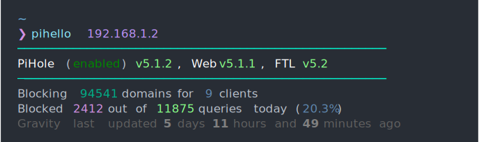

# Changelog

All notable changes to this project will be documented in this file.

The format is based on [Keep a Changelog](https://keepachangelog.com/en/1.0.0/),
and this project adheres to [Semantic Versioning](https://semver.org/spec/v2.0.0.html).

## [1.0.0] - 2026-07-24

Pi-hole v6 support. Thanks to [@scul86](https://github.com/scul86)!

### Changed (BREAKING)

- Targets the Pi-hole v6 REST API; Pi-hole v5 is no longer supported (use `pihello==0.3.0` for v5).
- The second positional argument is now your Pi-hole **app password** (Settings → Web interface / API) instead of the v5 API token.
- Template variables renamed to match the v6 API (see the README table), e.g. `{status}` → `{blocking}`, `{core_current}` → `{version.core.local.version}`, `{gravity_last_updated.relative.*}` → `{gravity.relative.*}`.
- Removed `-u`/`--uri` — the v6 API lives at a fixed `/api` path.

### Added

- `-k`/`--insecure` flag to skip TLS certificate verification for self-signed Pi-hole certs (verification is now ON by default).

### Fixed

- Failed authentication exits with code 1 instead of continuing and crashing.
- The API session is always closed on exit, even when a data fetch fails (Pi-hole v6 has a limited number of concurrent sessions).
- The session id is sent as a request header rather than in the URL query string.

## [0.3.0] - 2023-02-13

- Added initial Pi-hole API token support. Thanks to [@WillPresley](https://github.com/WillPresley)!  
  Now the `pihello` command has second required parameter: `token`.

## [0.2.7] - 2022-09-08

- No new features added
- Bumping versions of dev-dependencies

## [0.2.6] - 2020-10-19

### Added

- Added option `-p` `-proto` for pihole instances with HTTPS. Thanks to [@jonzobrist](https://github.com/jonzobrist).
- Added option `-u` `-uri` for setting different path to `/admin`. Thanks to [@jonzobrist](https://github.com/jonzobrist).
- Added some usage examples

### Fixed

- Fixed missing newline after timestamp
- Updated some command line argument descriptions

## [0.2.5] - 2020-10-16

### Added

- Added entrypoint to `pyproject.toml`. Now `pihello` can be run as a standalone command!

## [0.2.4] - 2020-10-16

### Added

- Added repository url and keywords to `pyproject.toml`

### Changed

- Renamed `__main__.py` to `cli.py` for better compatibility as a runnable script

## [0.2.3] - 2020-10-16

### Added

- Added example image  
  

### Fixed

- Fixed comparison between variables and None
- `--version` flag now displays the current version correctly

## [0.2.2] - 2020-10-15

### Added

- Added ability to read from file
- Added example script (`example.txt`)
- Added `normal` style (ANSI code 10)

### Changed

- No extra newline at the end when reading from file
- Pass keyword arguments to Python's print function instead

## [0.2.1] - 2020-10-12

### Added

- Added some project metadata to `pyproject.toml` for PyPI
- Created this `CHANGELOG.md`

## [0.2.0] - 2020-10-12

### Added

- Generated .gitignore from https://gitignore.io
- Added variable injection
- Added supporting documentation in README.md
- Began using [poetry](https://python-poetry.org) to manage the project
- Made the project into a callable module

### Changed

- Massive improvements on style parsing

### Removed

- `main.py` as this is now mostly in `__main__.py`
- `makefile` as this is not yet used
- `.vscode/`

## [0.1.0] - 2020-09-30

Initial prototype

### Added

- README.md
- LICENCE
- .gitignore
- Proof of concept on how to create this command line utility.
